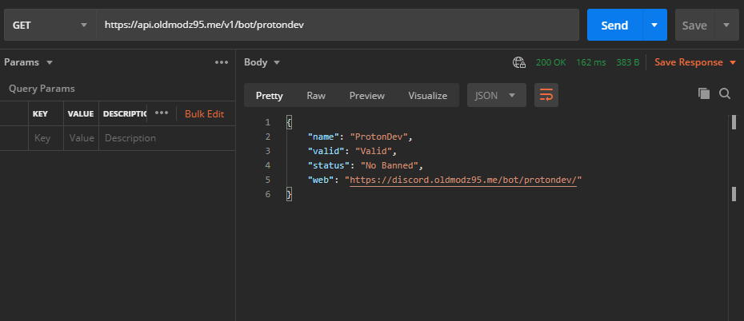

# Information Bot



Information BOT



Have the information of a single bot






NAME bot.







BOT successfully retrieved.


```
{
"name":"ProtonDev",
"valid":"Valid",
"status":"No Banned",
"web":"https:\/\/discord.oldmodz95.me\/bot\/protondev\/"
}
```




Invalid name or error


```
{"error":"Bot invalid or not found"}
```





## Forma Link

```text
https://api.oldmodz95.me/v1/bot/protondev
```

protondev = name bot



